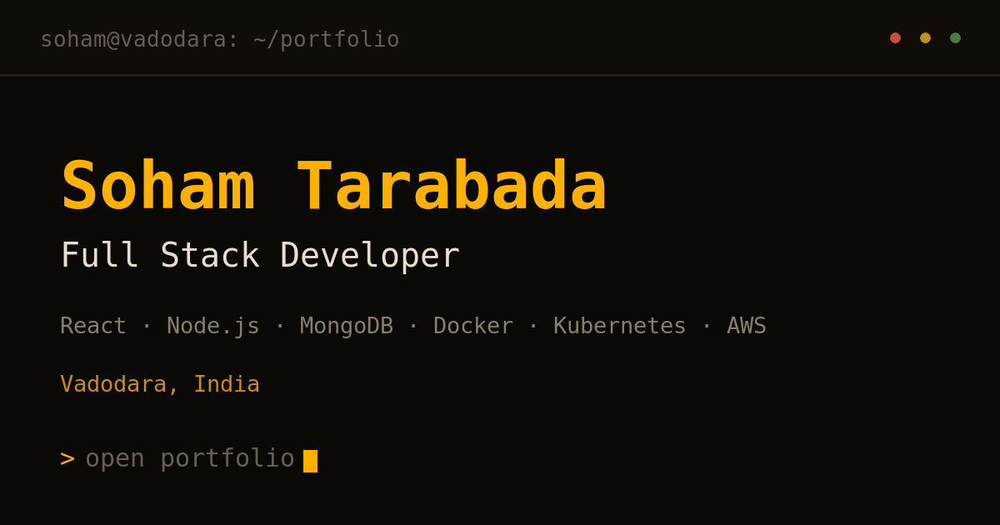
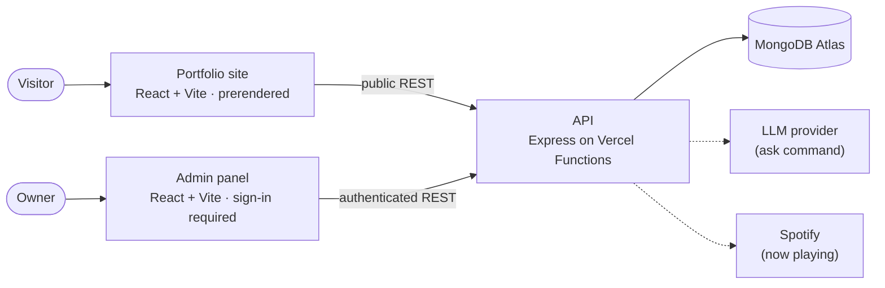

<div align="center">

# Soham Tarabada — Portfolio

**A developer portfolio built as a retro CRT terminal and code editor.**

[](https://soham-tarabada.vercel.app/)


[**Visit the site →**](https://soham-tarabada.vercel.app/)



</div>

---

## About

Instead of a scrolling landing page, this portfolio opens like an IDE. There's a file explorer, editor tabs,
a command palette and a working terminal, all drawn like an old phosphor CRT monitor. Every
section of the site (about, experience, projects, skills, education, uses, contact) is a "file" you can
open, and every one of them also has its own URL.

The content isn't hard-coded. It lives in MongoDB, is served by a small Express API, and is
edited through a private, sign-in-protected admin panel, so updating the portfolio never needs
a redeploy.

## Features

- **IDE-style interface.** It has a file tree, tabs that open, cycle and close like a real editor, a fuzzy
  command palette, and a status bar. Your open tabs are remembered for the session.
- **A real terminal.** It has a command history, tab completion and output that wraps to the
  terminal width. Type `help` to see every command.
- **`ask` — AI answers grounded in the site.** Ask a question about Soham's work and get an
  answer drawn *only* from the portfolio's own content. If the answer isn't there, it says so. The
  LLM provider is pluggable, and the command is rate-limited.
- **Four phosphor themes:** amber, green, cyan and mono. Every colour combination is checked
  against WCAG AA contrast.
- **Bit, the pixel guide.** A small sprite companion who can give you a guided tour of the site
  (`toon tour`).
- **Now playing.** The status bar shows the Spotify track that's currently playing (or the last one).
- **Resume.** The latest resume PDF is always one command away (`resume`).
- **Contact form.** Messages go straight to the admin inbox. Spam is filtered with a honeypot field and
  a timing check, with no third-party mail service involved.
- **SEO-ready.** Every route is prerendered to static HTML at build time, with its own title,
  description, canonical URL, Open Graph/Twitter cards, JSON-LD and a `<noscript>` fallback.
  `sitemap.xml` and `robots.txt` are generated from the same data.
- **Privacy-respecting analytics.** These are first-party counts only. There are no cookies, IP addresses
  are never stored, crawlers are ignored, and **Do Not Track / Global Privacy Control switch it
  off entirely**.

### Terminal commands

| Command                            | What it does                                   |
| ---------------------------------- | ---------------------------------------------- |
| `help`                             | List every command                             |
| `ls` · `cd` · `pwd` · `cat` · `open` | Move around and read the "files"             |
| `whoami`                           | The short version                              |
| `experience` · `projects` · `skills` · `education` · `uses` | Print a section     |
| `ask <question>`                   | Ask a question about Soham's work              |
| `resume`                           | Open the resume PDF                            |
| `contact` · `mail` · `email` · `socials` | Ways to get in touch                     |
| `spotify`                          | What's playing right now                       |
| `theme [name\|list\|next]`         | Switch phosphor colour                         |
| `toon [tour\|come\|dance\|say]`    | Summon Bit, the pixel guide                    |
| `neofetch` · `date` · `uptime` · `history` · `echo` | The usual suspects                |
| `keys`                             | Every keyboard shortcut                        |

### Keyboard shortcuts

| Shortcut                    | Action                     |
| --------------------------- | -------------------------- |
| <kbd>Ctrl/⌘</kbd> + <kbd>K</kbd> | Command palette       |
| <kbd>Ctrl</kbd> + <kbd>`</kbd>   | Toggle the terminal   |
| <kbd>Ctrl/⌘</kbd> + <kbd>B</kbd> | Toggle the file tree  |
| <kbd>Alt/⌥</kbd> + <kbd>]</kbd>  | Next open file        |
| <kbd>Alt/⌥</kbd> + <kbd>W</kbd>  | Close the current file|
| <kbd>B</kbd>                     | Call Bit over         |
| <kbd>?</kbd>                     | Show all shortcuts    |

## Tech stack

| Layer        | Tools                                                                 |
| ------------ | --------------------------------------------------------------------- |
| Frontend     | React 19, Vite, plain CSS with shared design tokens (no UI framework)  |
| Backend      | Node.js, Express 5, Mongoose, Zod validation, Helmet, rate limiting    |
| Database     | MongoDB Atlas                                                         |
| Auth (admin) | JWT access tokens + rotating, hashed refresh tokens, bcrypt passwords |
| PDFs         | PDFKit (server-side resume rendering)                                  |
| Hosting      | Vercel (static sites + serverless function)                           |

## Architecture



It's an npm-workspaces monorepo with three deployable apps and one shared package:

```
.
├── apps/
│   ├── web/        # The public portfolio (IDE shell, terminal, prerender script)
│   ├── api/        # Express API, deployed as a single Vercel serverless function
│   └── admin/      # Private content-management panel
└── packages/
    └── theme/      # Shared CRT design tokens, the four phosphor palettes, global CSS
```

## Running it locally

**Requirements:** Node.js 20+ (`.nvmrc` pins 24) and a MongoDB database (a free Atlas cluster
works).

```bash
# 1. Install all workspaces
npm install

# 2. Create local env files from the templates, then fill in your own values
cp apps/api/.env.example   apps/api/.env
cp apps/web/.env.example   apps/web/.env
cp apps/admin/.env.example apps/admin/.env

# 3. Seed the database with the initial content and an admin account
npm run seed

# 4. Start the API, the site and the admin panel together
npm run dev
```

| App   | Local URL               |
| ----- | ----------------------- |
| API   | http://localhost:4000   |
| Site  | http://localhost:5173   |
| Admin | http://localhost:5174   |

### Environment variables

Each app ships a `.env.example` listing what it needs, with placeholder values only. Copy it to
`.env` and use your own values.

- **`apps/api`** needs a MongoDB connection string, two *different* JWT signing secrets, and
  the email and password for the admin account that the seed script creates. Keys for the
  `ask` command and Spotify are optional. Without them those features switch themselves off,
  and everything else keeps working.
- **`apps/web`** and **`apps/admin`** need only the API's base URL and the site's public URL.
  These values are bundled into browser code, so **they must never contain a secret**.

> [!IMPORTANT]
> `.env` files are git-ignored and must never be committed. In production, every value is set in
> the Vercel project settings, not in this repository. Generate secrets with something like
> `openssl rand -hex 48`.

### Scripts

| Command          | What it does                                                         |
| ---------------- | -------------------------------------------------------------------- |
| `npm run dev`    | Run the API, site and admin panel together with live reload          |
| `npm run build`  | Build every app (the site build also prerenders each route)          |
| `npm run seed`   | Insert the initial content. It only adds what's missing and never overwrites edits |
| `npm run verify` | Run the end-to-end checks for both frontends against a running local API |

`npm run verify` checks logic that would otherwise need a browser. That includes routing, the
terminal's command registry, the diagram layout, WCAG contrast for every theme, the
prerendered SEO tags, the contact form, analytics batching and the admin workflows. It cleans up
anything it creates.

## Deployment

The site, the API and the admin panel are deployed as **three separate Vercel projects** from
this one repository, each using its own app folder as the root directory.

1. Deploy `apps/api` first and set its environment variables in Vercel.
2. Deploy `apps/web` and `apps/admin`, pointing each one at the API's URL.
3. Allow both frontend origins in the API's CORS setting.

The site's build fetches content from the API to prerender each page. The API needs to be
reachable during the build, and the site should be redeployed after adding a project or
renaming a section so that the static HTML catches up. Content edits show up for visitors
immediately either way.

## Privacy

- There are **no cookies** for visitors. A visit is a random id in `sessionStorage`, and it's
  forgotten when the tab closes.
- **IP addresses are never stored.** Rate limiting uses a salted hash that rotates daily.
- Do Not Track and Global Privacy Control are honoured in the browser, so nothing is sent at all.
- Analytics events and logged `ask` questions expire automatically.
- Contact messages are stored in the site's own database only, with no third-party relay.

## Security

Found a vulnerability? Please report it privately through the
[contact page](https://soham-tarabada.vercel.app/contact) rather than in a public issue.

## Author

**Soham Tarabada**, Full Stack Developer, Vadodara, India

[Portfolio](https://soham-tarabada.vercel.app/) ·
[LinkedIn](https://www.linkedin.com/in/soham-tarabada-51a50020b) ·
[GitHub](https://github.com/soham-tarabada)
